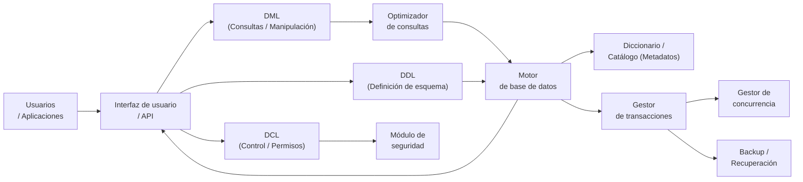
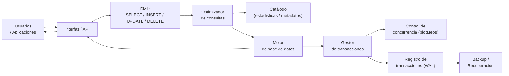
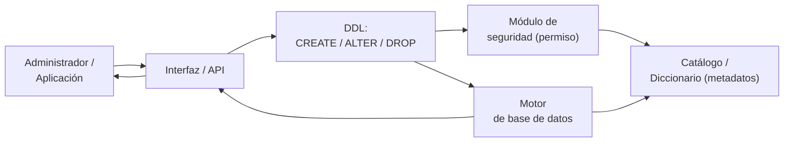
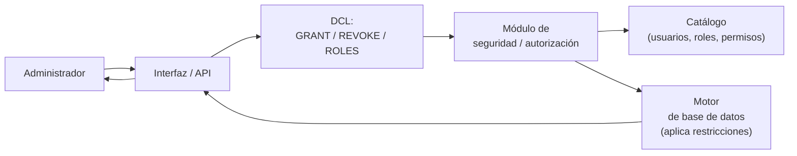
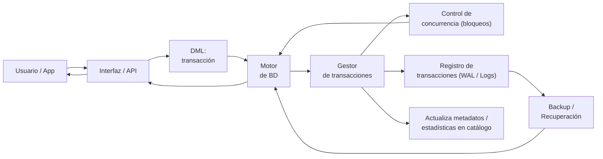

# Unidad 1 - Sistemas de almacenamiento de la información <!-- omit from toc -->

**Módulo:** Gestión de base de datos

**RA1:** Reconoce los elementos de las bases de datos, analizando sus funciones y valorando la utilidad de los sistemas gestores.

---

## 1. Ficheros

*(CE-a: Se han analizado los distintos sistemas lógicos de almacenamiento y sus funciones)*

* Un ordenador maneja y almacena una gran cantidad de información.
* La información se almacena en dispositivos como discos duros, pendrives, DVDs, etc. 
* Esta información almacenada debe estar adecuadamente organizada. 
* Para poder organizar la información se utilizan `los ficheros o archivos`

Antes de la aparición de las bases de datos, la información se almacenaba organizada en **ficheros** (archivos), gestionados directamente por los programas de aplicación o por el sistema operativo. Un **fichero** es un conjunto de **registros**, y cada registro está formado por **campos**.

Según cómo se organizan y se accede a los registros dentro del fichero, distinguimos varios tipos:

### 1.1 Ficheros planos (secuenciales)

- Los registros se almacenan **uno detrás de otro**, en el orden en que se van grabando (o según un criterio de ordenación, como una clave).
- Para acceder a un registro concreto hay que **leer desde el principio** hasta encontrarlo (acceso secuencial).
- **Ventajas:** estructura simple, fácil de crear y mantener, muy eficiente cuando se procesan **todos** los registros uno tras otro (por ejemplo, generar un listado completo).
- **Inconvenientes:** acceso lento a un registro concreto cuando el fichero es grande, ya que hay que recorrerlo desde el inicio; las operaciones de inserción/borrado en medio del fichero son costosas.
- **Ejemplo de uso:** ficheros de texto plano (`.txt`, `.csv`), copias de seguridad, procesos por lotes (*batch*).

- **Formato (texto o binario):** los ficheros planos se encuentran habitualmente en formato de texto legible (por ejemplo CSV), pero también pueden almacenarse en formato binario. En texto cada registro suele ser una línea y los campos se separan por delimitadores; en binario los registros pueden tener campos de tamaño fijo y ocupan menos espacio y se procesan más rápido. La elección depende de la necesidad de legibilidad/intercambio (texto) frente a rendimiento/compactación (binario).


**Ejemplo práctico (.txt):**

Imaginemos un fichero de texto plano llamado "clientes.txt" que almacena información de clientes, donde cada línea corresponde a un registro y los campos están separados por comas:

```
1,Garcia Perez,garcia@example.com,600123456
2,Lopez Martinez,lopez@example.com,600987654
3,Sanchez Diaz,sanchez@example.com,600555000
```

- Cada línea (por ejemplo `1,Garcia Perez,garcia@example.com,600123456`) es un **registro**: representa la información relacionada con una única entidad (aquí, un cliente).
- Los **campos** son las partes que componen el registro, separadas por comas en este ejemplo:
  - Campo 1: `1` (ID del cliente)
  - Campo 2: `Garcia Perez` (nombre)
  - Campo 3: `garcia@example.com` (correo electrónico)
  - Campo 4: `600123456` (teléfono)

> 📌 Nota: En ficheros planos los campos pueden separarse por comas (CSV), tabuladores, punto y coma u otros separadores, o bien tener longitudes fijas. Su simplicidad los hace útiles para intercambio de datos y pequeños procesos por lotes, pero su estructura no protege contra inconsistencias (por ejemplo, distinta ordenación de campos, falta de delimitadores o problemas con comas dentro de los campos). Para mitigar esto, es común usar comillas para campos de texto, incluir una cabecera con nombres de campos o aplicar reglas de validación en el proceso de importación. Si se requiere integridad, control de concurrencia y consultas complejas, conviene usar un SGBD.


### 1.2 Ficheros indexados

- Además de los datos, se mantiene una **estructura de índice** (similar al índice de un libro) que asocia cada valor de una clave con la posición física del registro correspondiente en el fichero.
- Permiten **dos formas de acceso**: secuencial (recorriendo todos los registros) y **por clave** (a través del índice), combinando lo mejor de ambos mundos.
- El acceso mediante el índice es mucho más rápido que recorrer todo el fichero, ya que el índice suele organizarse en estructuras eficientes de búsqueda (por ejemplo, árboles B o B+).
- **Inconvenientes:** ocupan más espacio (hay que guardar el índice además de los datos) y hay que mantener el índice actualizado cada vez que se modifica el fichero, lo que añade cierta sobrecarga en inserciones/borrados.

- **Formato (texto o binario):** los ficheros indexados suelen implementarse sobre formatos binarios que permiten direccionar con precisión offsets y manejar estructuras de índice (B-tree, B+tree) de forma eficiente. No obstante, también pueden existir soluciones híbridas: un fichero de datos en texto (CSV) con un índice externo binario que guarda offsets.

**Ejemplo práctico (indexado):**

Supongamos un fichero de datos `clientes.dat` donde cada registro ocupa una posición física (por ejemplo, número de registro) y existe un fichero índice `clientes.idx` que asocia la clave (ID) con esa posición:

Archivo de datos (clientes.dat) - `contenido conceptual`:
```
Registro#1: 1|Garcia Perez|garcia@example.com|600123456
Registro#2: 2|Lopez Martinez|lopez@example.com|600987654
Registro#3: 3|Sanchez Diaz|sanchez@example.com|600555000
```
Índice (clientes.idx) - entrada clave→posición:
```
1 -> Registro#1
2 -> Registro#2
3 -> Registro#3
```

- Si se busca el cliente con ID = 2, el sistema consulta el índice (muy rápido) y obtiene `Registro#2`, luego lee directamente la posición en el fichero de datos sin tener que recorrer todos los registros.
- En implementaciones reales el índice suele estar organizado en árboles (B-tree/B+tree) o en estructuras de hash, y puede residir en memoria para acelerar lecturas.

> 📌 Nota: Los ficheros indexados son especialmente útiles cuando las consultas por clave son frecuentes y se desea combinar acceso rápido por clave con la posibilidad de recorrer registros en orden.

### 1.3 Ficheros de acceso directo (aleatorio o relativo)

- Permiten acceder **directamente** a cualquier registro sin necesidad de recorrer los anteriores, normalmente calculando la posición física del registro a partir de su clave (por ejemplo, mediante una función *hash* o porque los registros tienen tamaño fijo y se calcula un desplazamiento).
- También se conocen como ficheros de **acceso aleatorio** o de **acceso relativo**.
- **Ventajas:** acceso muy rápido a un registro concreto, independientemente de su posición en el fichero.
- **Inconvenientes:** es necesario conocer o calcular la posición del registro; no son eficientes para procesar todos los registros de forma ordenada; puede haber colisiones si dos claves generan la misma posición (en el caso de acceso por *hash*).
- **Formato (texto o binario):** los ficheros de acceso directo se implementan típicamente en formato binario con registros de tamaño fijo o estructuras que permitan calcular offsets fiables. Esto facilita el cálculo directo de posiciones y el acceso por hashing. Implementaciones que intentan usar texto para acceso directo existen (por ejemplo, manteniendo un mapa de offsets), pero suelen ser menos eficientes.

**Ejemplo práctico (acceso directo mediante hashing):**

Imaginemos un fichero `cuentas.dat` en el que queremos almacenar cuentas bancarias y acceder por número de cuenta. Usando hashing, definimos una función simple que convierte el número de cuenta en una posición (slot) del fichero:

- Supongamos tamaño del fichero = 1000 slots.
- Hash(numero_cuenta) mod 1000 = posición.

Ejemplo conceptual:
```
Hash(1000456) mod 1000 -> 456  => almacenar registro en slot 456
Hash(2000102) mod 1000 -> 102  => almacenar registro en slot 102
Hash(3000001) mod 1000 -> 1    => almacenar registro en slot 001
```
- Para buscar la cuenta 2000102 se calcula su hash y se accede directamente al slot 102, sin necesidad de leer otros registros.
- Si dos cuentas colisionan (mismo slot), el sistema debe resolver la colisión (por ejemplo, con encadenamiento -lista en ese slot- o con sondeo abierto).

**Ejemplo práctico (acceso directo mediante desplazamiento fijo):**

Si los registros tienen tamaño fijo (por ejemplo 200 bytes), y conocemos el número de registro n, la posición física en bytes se calcula como:
```
offset = (n - 1) * record_size
```
Así, para leer el registro nº 10 el sistema salta directamente a offset = 9 * 200 = 1800 bytes y lee 200 bytes.

> 📌 Nota: Los ficheros de acceso directo ofrecen lecturas muy rápidas para búsquedas puntuales, pero su diseño requiere planificación (tamaño de registro, estrategia de resolución de colisiones) y suelen usarse cuando la latencia de acceso es crítica.


### 1.4 Comparativa de tipos de ficheros

| Tipo | Forma de acceso | Velocidad de acceso a un registro | Velocidad de proceso secuencial | Uso típico |
|---|---|---|---|---|
| **Plano (secuencial)** | Uno tras otro, desde el principio | Lenta | Muy rápida | Listados completos, copias de seguridad |
| **Indexado** | Secuencial o por índice | Rápida (vía índice) | Rápida | Sistemas con consultas frecuentes por clave |
| **Acceso directo** | Directa (cálculo de posición) | Muy rápida | Lenta/poco práctica | Localización puntual de registros concretos |

### 1.5 Limitaciones de los sistemas de ficheros frente a las bases de datos

El uso de ficheros gestionados de forma independiente por cada aplicación presenta problemas:

- **Redundancia e inconsistencia de datos** (el mismo dato duplicado en varios ficheros).
- **Dificultad para compartir información** entre distintas aplicaciones.
- **Dependencia entre datos y programas** (cualquier cambio en la estructura obliga a modificar el programa).
- **Falta de control centralizado de la seguridad y de la integridad**.
- **Problemas de acceso concurrente** (varios usuarios/programas accediendo a la vez).

Estas limitaciones son las que justifican la aparición de las **bases de datos** y de los **sistemas gestores de bases de datos (SGBD)**.

---

## 2. Bases de datos: conceptos, usos y tipos


### 2.1 Concepto de base de datos

*(CE-d: Se ha reconocido la utilidad de un sistema gestor de bases de datos)*

Una **base de datos** es un conjunto de datos organizados, estructurados y relacionados entre sí, almacenados de forma conjunta, sin redundancias innecesarias, y diseñados para ser utilizados por diferentes usuarios y aplicaciones de forma simultánea.

A diferencia de un simple conjunto de ficheros, una base de datos:

- Está gestionada por un software específico (el **SGBD**).
- Los datos son **independientes** de los programas que los usan.
- Permite compartir la información entre varios usuarios y aplicaciones a la vez.
- Garantiza la **integridad**, **consistencia** y **seguridad** de los datos.

### 2.2 Usos de las bases de datos

*(CE-d: Se ha reconocido la utilidad de un sistema gestor de bases de datos)*

Las bases de datos se utilizan prácticamente en cualquier ámbito donde haya que gestionar información de forma organizada:

- **Gestión empresarial:** clientes, proveedores, facturación, nóminas, inventario.
- **Administración pública:** censo, historiales médicos, registros civiles.
- **Comercio electrónico:** catálogos de productos, pedidos, usuarios.
- **Redes sociales y aplicaciones web:** perfiles de usuario, publicaciones, mensajes.
- **Sistemas científicos y de investigación:** almacenamiento de grandes volúmenes de datos experimentales.
- **Aplicaciones móviles y de escritorio:** almacenamiento local de configuración o datos del usuario.

### 2.3 Tipos de bases de datos según el modelo de datos

*(CE-b: Se han identificado los distintos tipos de bases de datos según el modelo de datos utilizado)*

El **modelo de datos** define cómo se organizan, estructuran y relacionan los datos dentro de la base de datos.

| Modelo | Descripción | Ejemplos de SGBD |
|---|---|---|
| **Jerárquico** | Los datos se organizan en forma de árbol (relaciones padre-hijo, 1:N). Un hijo solo puede tener un padre. | IMS (IBM) |
| **En red** | Similar al jerárquico, pero un registro puede tener varios "padres" (relaciones N:M), formando una estructura en forma de grafo. | IDS, IDMS |
| **Relacional** | Los datos se organizan en **tablas** (filas o tuplas y columnas o atributos), relacionadas mediante claves. Es el modelo más utilizado en la actualidad. | MySQL, PostgreSQL, Oracle, SQL Server |
| **Orientado a objetos** | Los datos se representan como objetos con atributos y métodos, de forma similar a la programación orientada a objetos. | db4o, ObjectDB |
| **Objeto-relacional** | Modelo híbrido: es relacional, pero admite tipos de datos complejos y objetos. | PostgreSQL, Oracle |
| **NoSQL (no relacional)** | Modelos alternativos al relacional pensados para grandes volúmenes de datos y alta escalabilidad: documentales, clave-valor, basados en grafos o en columnas. | MongoDB (documental), Redis (clave-valor), Neo4j (grafos), Cassandra (columnas) |

> **Evolución histórica:** Jerárquico → En red → Relacional → Orientado a objetos / NoSQL. El modelo **relacional**, propuesto por E. F. Codd en 1970, sigue siendo el más extendido, aunque el modelo **NoSQL** ha ganado peso con el Big Data y las aplicaciones web de gran escala.

### 2.4 Tipos de bases de datos según la ubicación de la información

*(CE-c: Se han identificado los distintos tipos de bases de datos en función de la ubicación de la información)*

| Tipo | Descripción | Ventajas | Inconvenientes |
|---|---|---|---|
| **Centralizada** | Toda la información se almacena en un único lugar físico (un servidor o equipo). | Fácil de administrar, control y seguridad centralizados, menor coste inicial | Punto único de fallo, posibles cuellos de botella con muchos usuarios |
| **Distribuida** | La información está repartida en varios equipos o ubicaciones físicas distintas, aunque el usuario la percibe como una única base de datos. | Mayor disponibilidad y tolerancia a fallos, mejor rendimiento, escalabilidad | Mayor complejidad de diseño y administración, problemas de sincronización entre nodos |

Dentro de las bases de datos distribuidas se suelen distinguir además:

- **Replicadas:** existen copias idénticas de los datos en distintas ubicaciones (mejora la disponibilidad y el rendimiento de lectura).
- **Fragmentadas:** los datos se dividen en partes (fragmentos) que se reparten entre distintos nodos (cada nodo almacena solo una porción de los datos).
- **En la nube:** alojadas en servidores de un proveedor externo (AWS, Azure, Google Cloud), accesibles a través de Internet.

---

## 3. Sistemas gestores de bases de datos (SGBD): funciones, componentes y tipos

### 3.1 Concepto de SGBD

Un **Sistema Gestor de Bases de Datos (SGBD)**, en inglés *DBMS (Database Management System)*, es el software que permite **crear, definir, manipular y administrar** una base de datos, actuando como intermediario entre los usuarios/aplicaciones y los datos almacenados físicamente.

### 3.2 Funciones de un SGBD

*(CE-e: Se ha descrito la función de cada uno de los elementos de un sistema gestor de bases de datos)*

- **Definición de la estructura de los datos:** permite crear tablas, especificar tipos de datos, relaciones y restricciones.
- **Manipulación de los datos:** inserción, consulta, actualización y eliminación de datos.
- **Independencia de los datos:** separa la estructura lógica de los datos de su almacenamiento físico, de modo que los programas no dependen de cómo se guardan realmente.
- **Reducción de la redundancia:** evita duplicar la misma información en distintos lugares.
- **Garantía de integridad y consistencia:** aplica reglas y restricciones para que los datos sean correctos y coherentes.
- **Control de acceso y seguridad:** define qué usuarios pueden acceder a qué datos y con qué permisos.
- **Control de la concurrencia:** gestiona el acceso simultáneo de múltiples usuarios sin conflictos ni pérdidas de información.
- **Gestión de transacciones:** garantiza que las operaciones se ejecuten de forma completa y correcta (propiedades **ACID**: Atomicidad, Consistencia, Aislamiento y Durabilidad).
- **Copias de seguridad y recuperación:** permite realizar *backups* y restaurar la base de datos ante fallos o pérdidas de datos.
- **Optimización de consultas:** determina la forma más eficiente de ejecutar cada consulta (uso de índices, orden de las operaciones).

### 3.3 Componentes (elementos) de un SGBD

*(CE-e: Se ha descrito la función de cada uno de los elementos de un sistema gestor de bases de datos)*

| Componente | Función |
|---|---|
| **Motor de base de datos** | Núcleo del sistema; se encarga del almacenamiento, recuperación y actualización física de los datos. |
| **Lenguaje de Definición de Datos (DDL)** | Permite definir la estructura de la base de datos: tablas, tipos de datos, relaciones, restricciones (p. ej. `CREATE TABLE`). |
| **Lenguaje de Manipulación de Datos (DML)** | Permite consultar y modificar los datos: `SELECT`, `INSERT`, `UPDATE`, `DELETE`. |
| **Lenguaje de Control de Datos (DCL)** | Gestiona permisos y seguridad de acceso (`GRANT`, `REVOKE`). |
| **Diccionario de datos (catálogo del sistema)** | Almacena los **metadatos**: información sobre tablas, columnas, tipos, relaciones, usuarios y permisos. |
| **Gestor de transacciones** | Garantiza el cumplimiento de las propiedades ACID en cada operación. |
| **Gestor de la concurrencia** | Controla el acceso simultáneo de varios usuarios, evitando bloqueos e interbloqueos. |
| **Módulo de seguridad y autorización** | Controla la autenticación de usuarios y sus permisos sobre los datos. |
| **Módulo de copia de seguridad y recuperación** | Permite realizar copias de seguridad y restaurar la base de datos tras un fallo. |
| **Optimizador de consultas** | Analiza las consultas y decide la estrategia de ejecución más eficiente. |
| **Interfaz de usuario / API** | Permite a los usuarios y aplicaciones interactuar con el SGBD (línea de comandos, interfaz gráfica, conectores ODBC/JDBC). |

#### 3.3.1 Diagrama 1: Visión general de componentes y flujos principales


- El usuario o la aplicación envía solicitudes a través de la interfaz (UI / API).
- Desde la interfaz se lanzan tres tipos de acciones: operaciones sobre los datos (DML), definiciones de esquema (DDL) y órdenes de control/permiso (DCL).
- Las peticiones DML pasan por el optimizador de consultas y llegan al motor de base de datos para su ejecución física.
- Las sentencias DDL se envían al motor para aplicar cambios en el esquema (creación/alteración/eliminación de objetos).
- Las órdenes DCL se dirigen al módulo de seguridad para comprobar/gestionar permisos.
- El motor accede al diccionario de datos / catálogo para leer metadatos y estadísticas, y coordina las operaciones mediante el gestor de transacciones.
- El gestor de transacciones actúa sobre el control de concurrencia y los mecanismos de backup/recuperación.
- Finalmente el motor devuelve resultados y estado a la interfaz para que lleguen al usuario.

#### 3.3.2 Diagrama 2: Flujo DML (consulta/actualización)


- El usuario envía una consulta o modificación (SELECT/INSERT/UPDATE/DELETE) a través de la interfaz.
- La petición DML llega al optimizador de consultas, que consulta el catálogo (estadísticas, índices y metadatos) para elegir un plan eficiente.
- El optimizador entrega el plan al motor de base de datos, que ejecuta las operaciones físicas sobre los datos.
- Durante la ejecución, el motor interactúa con el gestor de transacciones para asegurar propiedades ACID: registra las operaciones (WAL / logs) y coordina bloqueos con el control de concurrencia.
- Los logs pueden usarse posteriormente por el subsistema de backup/recuperación para restaurar el estado en caso de fallo.
- El motor devuelve el resultado a la interfaz y de ahí al usuario.
  
#### 3.3.3 Diagrama 3: Flujo DDL (definición de esquema)


- Un administrador o aplicación envía una sentencia DDL (CREATE / ALTER / DROP) mediante la interfaz.
- Antes de aplicar cambios críticos, el DDL puede pasar por el módulo de seguridad para verificar permisos.
- El motor de base de datos procesa la sentencia DDL y actualiza la estructura física y lógica de la base de datos.
- El motor actualiza el catálogo/diccionario de datos con la nueva información del esquema (tablas, columnas, restricciones, etc.).
- El motor comunica el resultado de la operación a la interfaz y por tanto al administrador.
  
#### 3.3.4 Diagrama 4: Flujo DCL (gestión de permisos y control)


- Un administrador emite comandos DCL (por ejemplo GRANT o REVOKE) desde la interfaz.
- El DCL se gestiona en el módulo de seguridad/autorización que administra usuarios, roles y privilegios.
- El módulo de seguridad consulta y actualiza el catálogo donde se almacenan los metadatos de usuarios/roles/permisos.
- Eventualmente el módulo de seguridad informa al motor para que aplique o haga cumplir las restricciones sobre operaciones futuras.
- El resultado del cambio (éxito / fallo) se comunica de vuelta a la interfaz y al administrador.

#### 3.3.5 Diagrama 5: Flujo de transacciones, concurrencia y recuperación


- El usuario inicia una transacción (conjunto de operaciones DML) a través de la interfaz.
- La transacción es procesada por el motor de BD y coordinada por el gestor de transacciones.
- El gestor de transacciones usa el control de concurrencia para gestionar bloqueos y aislamientos entre transacciones concurrentes, evitando inconsistencias y conflictos.
- Simultáneamente, el gestor de transacciones escribe registros en el log (WAL / transaction log) para garantizar durabilidad.
- Los registros sirven para que el módulo de backup/recuperación pueda restaurar la base de datos hasta un estado consistente tras un fallo.
- Durante la ejecución la transacción puede actualizar metadatos y estadísticas en el catálogo.
- Cuando la transacción termina (commit o rollback), el motor devuelve el resultado a la interfaz y al usuario.

### 3.4 Tipos de sistemas gestores de bases de datos

*(CE-f: Se han clasificado los sistemas gestores de bases de datos)*

Los SGBD se pueden clasificar según varios criterios:

- **Según el modelo de datos que implementan:** jerárquicos, en red, relacionales (MySQL, PostgreSQL, Oracle, SQL Server), orientados a objetos, objeto-relacionales y NoSQL (documentales, clave-valor, columnares, grafos).
- **Según el número de usuarios que soportan:**
  - **Monousuario:** solo un usuario puede acceder a la vez (p. ej. Microsoft Access en modo local).
  - **Multiusuario:** varios usuarios pueden acceder simultáneamente (p. ej. MySQL, Oracle, SQL Server).
- **Según la ubicación de los datos que gestionan:** SGBD centralizados y SGBD distribuidos.
- **Según la licencia:**
  - **Libres / de código abierto:** MySQL (Community), MariaDB, PostgreSQL, SQLite.
  - **Propietarios / comerciales:** Oracle Database, Microsoft SQL Server, IBM Db2.
- **Según el tamaño y ámbito de uso:**
  - **De escritorio / embebidos:** SQLite, Microsoft Access (pequeñas aplicaciones, poco volumen de datos).
  - **Empresariales / de gran capacidad:** Oracle, SQL Server, PostgreSQL, MySQL, Db2 (grandes volúmenes, alta concurrencia).

---

## 4. Esquema-resumen

```
Sistemas de almacenamiento de la información
│
├── 1. FICHEROS
│     ├── Planos (secuenciales)
│     ├── Indexados
│     └── De acceso directo (aleatorio/relativo)
│
├── 2. BASES DE DATOS
│     ├── Concepto y usos
│     ├── Según el MODELO DE DATOS
│     │     Jerárquico · En red · Relacional · Orientado a objetos ·
│     │     Objeto-relacional · NoSQL
│     └── Según la UBICACIÓN
│           Centralizada · Distribuida (replicada, fragmentada, en la nube)
│
└── 3. SGBD (Sistema Gestor de Bases de Datos)
      ├── Funciones: independencia, integridad, seguridad, concurrencia,
      │             transacciones (ACID), backup/recuperación, optimización
      ├── Componentes: motor, DDL, DML, DCL, diccionario de datos,
      │               gestor de transacciones, gestor de concurrencia,
      │               seguridad, backup/recovery, optimizador, interfaz
      └── Tipos: por modelo de datos, por nº de usuarios, por ubicación,
                 por licencia, por tamaño/ámbito de uso
```

---

## 5. Glosario de términos clave

- **Registro:** conjunto de campos que forman una unidad de información dentro de un fichero o tabla.
- **Campo:** cada uno de los datos elementales que componen un registro.
- **Índice:** estructura auxiliar que agiliza la búsqueda de registros por una clave.
- **SGBD/DBMS:** Sistema Gestor de Bases de Datos.
- **Metadatos:** datos que describen la estructura de otros datos.
- **Clave primaria (PK):** campo que identifica de forma única cada registro.
- **Clave ajena/foránea (FK):** campo que referencia la clave primaria de otra tabla.
- **Transacción:** conjunto de operaciones que se ejecutan como una unidad indivisible.
- **ACID:** Atomicidad, Consistencia, Aislamiento (Isolation) y Durabilidad.
- **Redundancia:** repetición innecesaria de datos.
- **Concurrencia:** acceso simultáneo de varios usuarios a los mismos datos.

---

## 6. Actividades propuestas (autoevaluación)

1. Explica la diferencia entre un fichero plano, uno indexado y uno de acceso directo, indicando una ventaja y un inconveniente de cada uno.
2. Explica la diferencia entre un sistema de ficheros y una base de datos, indicando al menos tres ventajas de esta última.
3. Pon un ejemplo real de empresa u organización que use una base de datos **distribuida** y explica por qué le conviene ese modelo frente a una centralizada.
4. Indica qué modelo de datos utilizarías para: (a) una red social con relaciones de amistad, (b) el catálogo de un supermercado, (c) el registro de sesiones de una web con millones de accesos por segundo.
5. Enumera los componentes de un SGBD y explica con tus palabras qué función cumple el **diccionario de datos**.
6. Clasifica los siguientes SGBD según su modelo de datos: MySQL, MongoDB, Neo4j, Redis, Oracle.
7. ¿Qué significa que un SGBD garantice la **independencia de los datos**? Pon un ejemplo.

---

